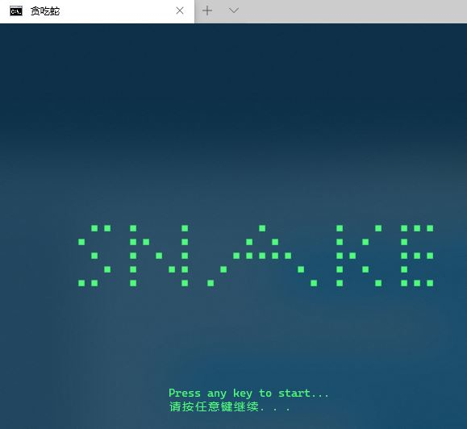
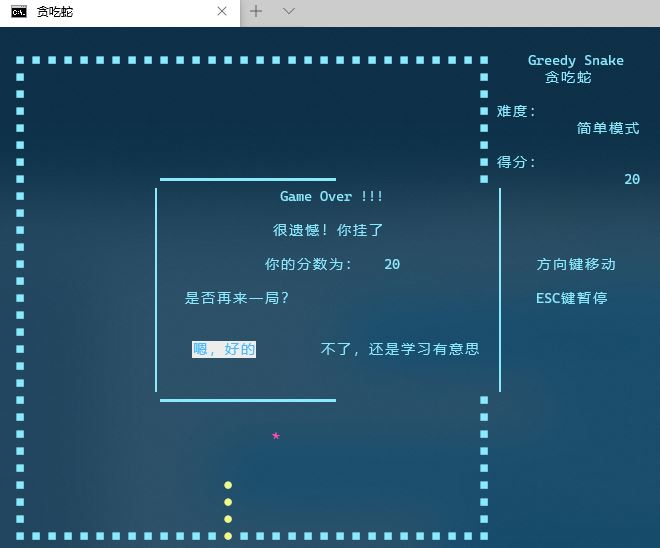

# GreedySnake
本项目原始来源：http://blog.csdn.net/silence1772/article/details/55005008

github地址:https://github.com/silence1772/GreedySnake

## 一些改动

- 之前所写的游戏先通过光标定位，在使用cout进行字符输出显示。原本代码没有更改光标显示，于是就造成了光标闪烁问题。解决方案：游戏运行过程中隐藏光标，游戏结束时恢复光标，参考stackoverflow https://stackoverflow.com/questions/18028808/remove-blinking-underscore-on-console-cmd-prompt.设置代码如下（位于tools.cpp中）:

  ```c++
  void ShowConsoleCursor(bool showFlag)
  {
      HANDLE out = GetStdHandle(STD_OUTPUT_HANDLE);
      CONSOLE_CURSOR_INFO cursorInfo;
  
      GetConsoleCursorInfo(out, &cursorInfo);
      cursorInfo.bVisible = showFlag; // set the cursor visibility
      SetConsoleCursorInfo(out, &cursorInfo);
  }
  ```

- 之前代码某些地方（例如Map，Snake等）都是用指针去实现的，可对比源代码去看。个人觉得这些地方直接使用对象即可满足要求，还不需要程序员自己去负责delete new出来的内存。

- 之前代码游戏结束后并没有恢复cmd文字颜色，导致有些奇怪，这里在游戏结束后进行了恢复，并重现光标，具体位于controller.cpp的Game()中

  ```c++
  SetConsoleTextAttribute(GetStdHandle(STD_OUTPUT_HANDLE), FOREGROUND_RED |
  									                     FOREGROUND_GREEN |
  									                     FOREGROUND_BLUE);
  ShowConsoleCursor(true);
  ```

- 调整了文件结构，源码和头文件分开，并尝试了g++编译和cmake编译


## 试玩

直接下载[version3](./release/snake3.exe)，命令行运行snake3.exe即可。

## 编译

- g++ 编译

  ```shell
  g++ src/*.cpp -o snake3.exe -I include -fexec-charset=GBK
  ```

  由于本游戏中出现了大量中文字符显示，因此很容易出现中文乱码问题。这里也对乱码问题进行一个总结。相关表述参考https://www.cnblogs.com/lsgxeva/p/12161743.html.

  > 乱码问题是由编码和解码方式不一致引起的。设置到编码的地方
  >
  > 1.源码字符集
  >
  > 2.执行字符集（可执行程序的编码）
  >
  > 3.运行环境字符集（windows cmd，linux shell)
  >
  > g++默认源码编码和执行字符集编码都是utf8，而linux shell会按照utf8解码（也称locale是utf8解码的），这样一般在linux上代码写包含中文的cout都是ok的。但是在windows cmd中，locale按照GBK解码，这样一样原本可执行程序按照utf8编码却要按照GBK解码来运行，中文就都会乱码，所以这里需要把可执行程序的编码设置为GBK(-fexec-charset=GBK)

  当然代码编译之后还会去链接一些动态库，windows下就是.dll文件，linux就是.so文件。自己电脑上有些动态库别人电脑上可能没有，就会导致游戏不能玩。因此又出现了静态编译的概念。g++命令通过加一个static实现。

  ```shell
  g++ src/*.cpp -o snake3.exe -I include -fexec-charset=GBK -static
  ```

- cmake编译

  cmake是linux下一个非常高效的工具，程序员只需要写一点CMakeLists文件就能实现自动化编译过程。在linux上使用cmake比较简单，在windows上使用cmake稍微麻烦点。

  1.下载cmake安装好，并将cmake的bin目录配置到环境变量；

  2.下载好MinGW，并把mingw的bin目录和mingw下的mingw32-make.exe的路径配置到环境变量。

  3.重新启动一个cmd，进行项目根目录下，配置CMakeList.txt

  CMakeList.txt如下：

  ```cmake
  # CMake 最低版本号要求
  cmake_minimum_required (VERSION 2.8)
  
  # 项目信息
  project (snake)
  
  # 设置C++11
  set(CMAKE_CXX_STANDARD 11)
  
  # 设置源码根路径，即 cpp 目录
  aux_source_directory(./src/ DIR_SRCS)
  
  # 设置头文件位置
  include_directories(${CMAKE_CURRENT_LIST_DIR}/include/)
  
  # 编译成可执行文件，如果编译动态库可以用：target_link_libraries
  add_executable(snake ${DIR_SRCS})
  ```

  以及PreLoad.cmake。由于windows下cmake默认的generator是VS（如果装了visual studio的话），就不会生成makefile。使用PreLoad.cmake改变generator为MinGW Makefiles。linux下由于默认是Unix Makefiles（cmake -G查看）就不用。操心了

  ```cmake
  set(CMAKE_GENERATOR "MinGW Makefiles" CACHE INTERNAL "" FORCE)
  ```

  准备好CMakeLists.txt之后，分别进行

  ```shell
  cmake .
  make
  ```

  就能得到最终的可执行程序了。由于mingw32-make.exe名称不是make.exe，直接复制一份重命名为make.exe放在原路径下就行了。

  

  有关cmake中CMakeLists.txt的书写规则可以参考

  [1]https://www.hahack.com/codes/cmake/

  [2]https://blog.csdn.net/hizcard/article/details/86601691

  [3]https://blog.csdn.net/ducal90/article/details/96432700

## 还存在问题

目前关于cmake还存在以下问题

- cmake如何解决windows下中文乱码这个问题还没有解决，但考虑到cmake一般用在linux下，而linux下是不会出现中文乱码的问题，像windows下一般都有IDE来完成编译任务，想来也不是很大问题。

  > 本项目release下的snake.exe和snake2.exe没有考虑编码问题和动态编译问题，所以别的电脑会出现两个问题，一个是动态库丢失，还有就是中文乱码，乱码的临时解决方案是cmd输入chcp 65001设置cmd按照utf-8解码。

- snake3.exe使用的是g++编译，设置了可执行程序编码GBK，以及使用静态编译，能够完好运行。但是体积有些大，后续还需要优化。

## 意见与反馈

关于本项目如果有什么问题，或者有什么更好玩的点想加入进去欢迎联系我，github issue 或 邮箱联系 xk_wang@qq.com.

## 游戏截图


